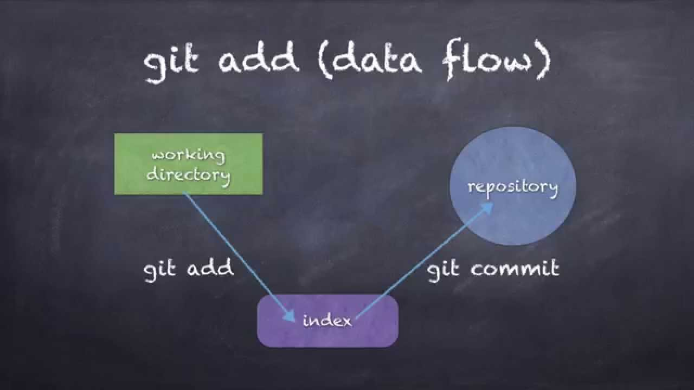

___
### **git add**
___

license: [MIT](./license.md)
___

Команда git add добавляет содержимое рабочей директории в индекс (staging area) для последующего коммита. По умолчанию git commit использует лишь этот индекс, так что вы можете использовать git add для сборки слепка вашего следующего коммита.


Это одна из ключевых команд Git, мы упоминали о ней десятки раз на страницах книги. Ниже перечислены наиболее интересные варианты использования этой команды.

```bash=
git add.
```
___
***[к содержанию<](./readme.md)***
___
___