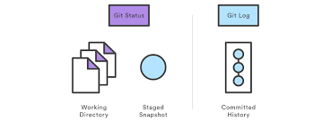

___
### **git status**
___

___
Команда git status показывает состояния файлов в рабочей директории и индексе: какие файлы изменены, но не добавлены в индекс; какие ожидают коммита в индексе. Вдобавок к этому выводятся подсказки о том, как изменить состояние файлов.
```
git status.
```
___
***[к содержанию<](./readme.md)***
___
___