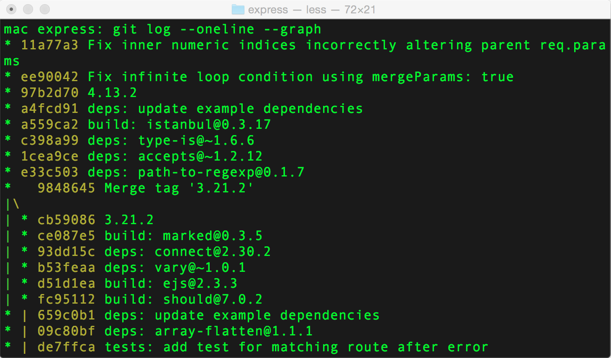
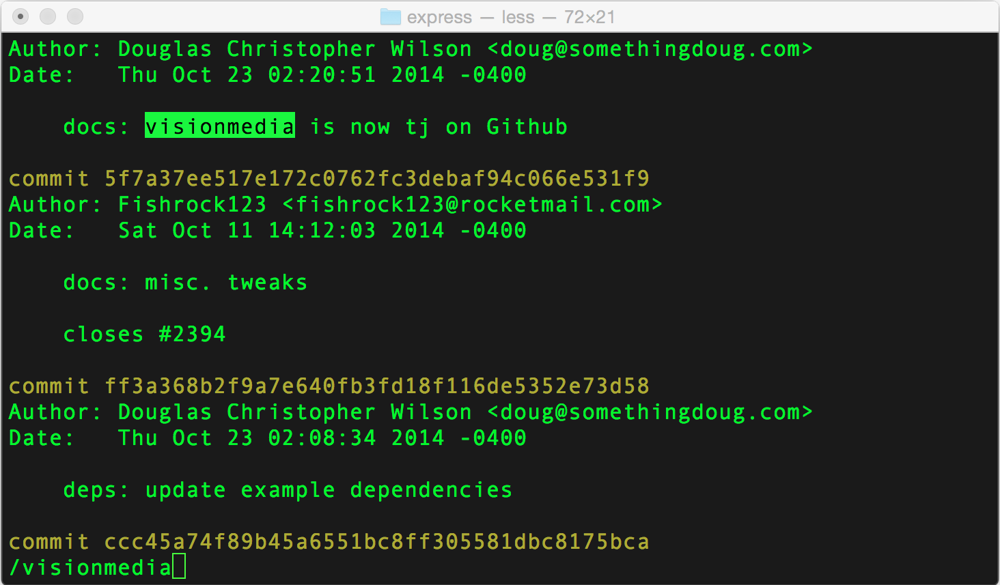

___
### **Дополнительные советы GIT**
___

___
**Параметры для удобного просмотра лога**

***Пример команды: git log --oneline --graph***

Скорее всего, вам уже доводилось использовать команду git log. У неё есть много полезных параметров, которые можно комбинировать друг с другом для достижения наилучшего результата. Чаще всего я использую эти:

    --author="Alex Kras" — выводит коммиты, сделанные конкретным человеком
    --name-only — выводит только названия изменённых файлов
    --oneline — выводит сокращённые данные коммита (в виде одной строки)
    --graph — выводит дерево зависимостей для всех коммитов
    --reverse — выводит коммиты в обратном хронологическом порядке (сначала старые)
    --after — выводит коммиты, сделанные после определённой даты
    --before — выводит коммиты, сделанные до определённой даты

К примеру, когда-то у меня был руководитель, который требовал еженедельные отчёты каждую пятницу. И мне было достаточно написать git log --author="Alex Kras" --after="1 week ago" --oneline, немного подредактировать полученный результат и отправить их начальству.

Вообще, в Git есть много всяких полезных параметров. Просто попробуйте выполнить man git-log чтобы посмотреть все варианты просмотра истории. Если ни один из предложенных вариантов вас не устроит, вы всегда можете воспользоваться параметром --pretty, с помощью которого можно настраивать выдачу в широких пределах.
___

___
Вывод актуальных изменений в файл

Пример команды: git log -p filename

С помощью команд git log -p или git log -p filename можно посмотреть не только примечание к коммиту, автора и дату, но также сделанные в этом коммите изменения.

Далее можно использовать функцию поиска утилиты less, набрав «слеш» и введя поисковый запрос: /{{поисковый-запрос}} (используйте маленькую "n" для перехода к следующему результату поиска и большую "N" для того, чтобы вернуться к предыдущему)
___
***[к содержанию](./readme.md)***
___
___
